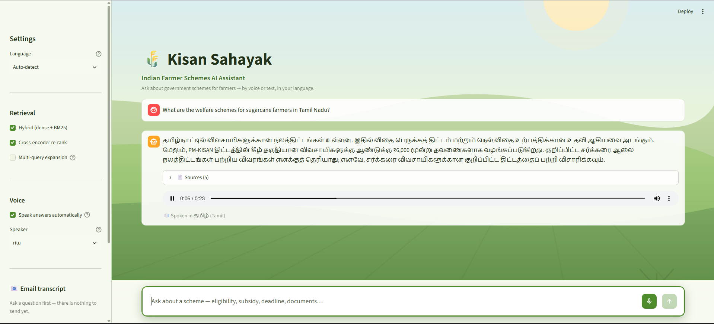

# 🌾 Kisan Sahayak — Indian Farmer Schemes AI Assistant

> A farmer asks about a government scheme — **by voice or text, in their own
> language** — and gets a grounded, source-cited answer back in that language,
> read aloud automatically.



*Asked in English about Tamil Nadu sugarcane schemes; answered in Tamil with five
cited sources and spoken aloud. Note the last clause: it says plainly that it
does not know about sugar-mill-specific schemes rather than inventing them.*

Built on LangChain **LCEL** — the whole pipeline, guards included, composes as
Runnables — with Sarvam for language and voice, and a local FAISS index over a
curated, English-only corpus of scheme documents.

---

## 1. What It Does

| | |
|:--|:--|
| **Ask** | Type or speak in Tamil, Hindi, Kannada, Telugu, Malayalam or English — one chat bar, mic inside it |
| **Answer** | Generated **directly in the farmer's language**, grounded in retrieved chunks, spoken aloud via Bulbul |
| **Prove** | Every answer carries its source chunks; if the corpus can't support it, the app says so instead of guessing |

Nothing is fetched from the web at query time. The corpus is built once, offline.

---

## 2. Pipeline

```
   farmer speaks or types  ·  any of six languages
                    │
   1  validate input  ·  screen prompt injection
   2  detect language  ·  translate to English
   3  condense follow-up using conversation history
                    │
   4  hybrid retrieve   FAISS  ∪  BM25
   5  cross-encoder rerank
                    │
   6  relevance gate ──── weak ────────────┐
                    │ strong               │
   7  generate in the farmer's language    │
                    │                      │
   8  groundedness gate                    │
          ungrounded → retry ⟳ (3, 20s)    │
                    │ grounded             │
   9  topical rail  ·  attach citations    │
                    │                      │
                    ▼                      ▼
   10  answer in-language, spoken aloud    no-confident-answer
       (Bulbul TTS)                        fallback, in-language
                    │
        every turn logged to JSONL  ·  emailed on request
```

Every stage is a `Runnable`; the branch is a `RunnableBranch`; memory is
`RunnableWithMessageHistory`. One dict flows through, accumulating keys via
`RunnablePassthrough.assign`.

**Worth knowing:**

- **Memory feeds retrieval, not just generation.** A follow-up like *"any
  deadline?"* is condensed into a standalone query using the conversation, or
  retrieval would search five ambiguous words.
- **The language directive is repeated after the history.** In the system prompt
  alone it loses to recent context — after two English turns, a Tamil question
  was answered in English.

---

## 3. RAG Techniques

All LangChain-native, all toggleable via one `RetrieverConfig` so the eval can
attribute each accuracy delta to exactly one technique.

| Technique | Implementation |
|---|---|
| Recursive + section chunking | `RecursiveCharacterTextSplitter`, child 500/80 inside heading-split parents |
| Metadata enrichment | Per-section scheme/category/state detection — **60% of chunks carry a scheme name** |
| Hybrid retrieval | `EnsembleRetriever` (FAISS dense ∪ BM25, 0.6/0.4) |
| Multi-query | `MultiQueryRetriever` |
| RAG-fusion | Custom LCEL step, reciprocal rank fusion |
| HyDE | LCEL chain — hypothetical answer → embed → search |
| Self-query | LLM → metadata filter → FAISS `filter` |
| Parent-document | Embed child chunks, return the full section |
| Compression + rerank | `ContextualCompressionRetriever` + cross-encoder |

---

## 4. Guards

| Layer | Guards against |
|---|---|
| Input validation | Junk, oversized, non-text input |
| Prompt-injection screen | Regex first (₹0), LLM classifier only for suspicious input |
| Relevance gate | Answering from irrelevant context |
| **Groundedness gate** | Hallucinated eligibility, amounts, deadlines, documents |
| Topical rail | Off-domain use |
| Memory + transcript | Losing context; no audit trail |

The groundedness gate **retries generation** before giving up (bounded by a 20s
budget), so a recoverable miss doesn't become a false "I don't know". Canned
guard messages are translated into the farmer's language.

Every external dependency degrades rather than failing the turn: a re-ranker
that won't load falls back to retrieval order, an LLM-backed retriever that
errors falls back to dense search, TTS failure still shows the text answer.
Classifiers **fail open**; the groundedness gate is the one that fails **closed**.

---

## 5. Corpus

Three source types, ingested offline into **1,666 chunks**:

| Source | Type | Chunks |
|---|---|---|
| `SCHEMES.pdf` (296 pp, Odisha + central schemes) | `pdf` | ~1,535 |
| `tnau-paddy-schemes.htm` (TN/Kerala/Karnataka) | `html` | 73 |
| `testbook-agri-schemes.json` (Playwright scrape) | `web` | 58 |

**Ten scanned pages** are recovered by Sarvam Document AI OCR — content plain
text extraction could not see, including a per-hectare potato cultivation cost
model.

Problems found by measuring the corpus, not by reading the code:

- **Chunking shredded the PDF.** First build: 4,385 chunks, *median 25
  characters* — fragments like `'FW:'`. Minimum section/chunk floors fixed it
  (1,666 chunks, median 454, none under 120).
- **Navigation text outranked content.** A menu bar scored **0.997** on "Tamil
  Nadu schemes" while containing no answer. Stripped by link density.
- **OCR tables were 59% HTML markup.** Embedding budget spent on `<td>`, so a
  page titled *"cultivation of 1 Ha. of Potato"* lost to one about subsidies.
  Tables are now flattened to text.

---

## 6. Accuracy

25 hand-labelled questions, 14 schemes, four question types, scored by a
home-grown two-stage harness. **Stage 1** is deterministic — retrieved chunk IDs
compared to labelled ones, so it costs nothing and reproduces exactly. **Stage 2**
is a hand-written judge prompt on Sarvam, versioned in this repo.

| Configuration | Hit Rate ↑ | MRR ↑ | Ctx Prec ↑ | Faithful ↑ | Correct ↑ |
|---|---|---|---|---|---|
| baseline — dense only | 0.840 | 0.638 | 0.176 | 0.900 | 0.700 |
| + hybrid | 0.800 (−0.040) | 0.653 (+0.015) | 0.168 (−0.008) | 0.840 (−0.060) | 0.720 (+0.020) |
| **+ rerank** | **0.880 (+0.040)** | **0.726 (+0.088)** | 0.184 (+0.008) | 0.900 (+0.000) | 0.720 (+0.020) |
| + expansion | 0.840 (+0.000) | 0.721 (+0.083) | 0.184 (+0.008) | **0.940 (+0.040)** | 0.720 (+0.020) |

**Re-ranking is the technique that pays.** +0.040 hit rate and **+0.088 MRR**,
reproduced identically across three corpus revisions (1,457 / 1,937 / 1,666
chunks) — the right chunk moves up the list, which is what the answer is built
from.

**Reading the numbers:**

- **Stage 1 carries the argument; stage 2 is directional.** An LLM judging an
  LLM — and judging its own output, since generator and judge are the same
  model — moves several points between runs. An earlier run of this harness put
  re-rank faithfulness at 0.960; it did not replicate.
- **Hybrid alone slightly hurts here.** BM25 surfaces lexical near-misses that
  dense already ranked better at this corpus size. Reported as measured.
- **Correctness falls as faithfulness rises**, by construction: a stronger stack
  triggers the groundedness gate more often, and a fallback is *faithful*
  (invents nothing) but *incorrect* (lacks the fact). Read the pair together.
- All configs are scored at a fixed **top-5** cutoff — they return different
  numbers of documents (dense 10, hybrid ~19, re-ranked 5), so scoring full
  result sets would compare result-set size rather than ranking quality.

---

## 7. Setup

```bash
pip install -r requirements.txt
playwright install chromium
cp .env.example .env          # add SARVAM_API_KEY and OPENAI_API_KEY

python ingestion/build_index.py     # offline, once
streamlit run app.py                # run from this directory
python eval/run_eval.py --stage 1   # free, deterministic
```

| Var | For |
|---|---|
| `SARVAM_API_KEY` | LLM, STT, TTS, translation, OCR |
| `OPENAI_API_KEY` | Embeddings only |
| `SMTP_*`, `EMAIL_TO` | Transcript email (optional) |

| If you see | Do this |
|---|---|
| A `torchvision` traceback in the log | Harmless — it's Streamlit's dev file-watcher, not this app. Launch from this directory so `.streamlit/config.toml` applies and it goes quiet |
| `faiss_index not found` | `python ingestion/build_index.py` |
| Every answer is "I could not find this" | `LLM_MODEL` must be `sarvam-105b-conversations`; the base model returns empty completions |
| Re-ranking takes ~30s per question | Leave `RERANKER_MODEL` unset so the light CPU model is selected |

Code changes need a restart — the file-watcher is off.

---

## 8. Repository

```
app.py                  Streamlit UI (voice + text edges only)
ingestion/              load_pdf · load_html · scrape_playwright · normalize · build_index
rag/                    retrievers · rerank · chain (LCEL) · validators (guards)
services/               sarvam (LLM/STT/TTS/translate/OCR) · transcript (JSONL + email)
eval/                   golden_set.jsonl · build_golden_set · metrics · judge · run_eval
data/raw/               source documents + scheme_map.json
data/processed/         generated — documents.jsonl · parents.jsonl · faiss_index · transcripts
```

**Stack.** LangChain LCEL · `sarvam-105b-conversations` · OpenAI
`text-embedding-3-small` (1536-d) · FAISS `IndexFlatIP` · BM25 ·
`ms-marco-MiniLM-L6-v2` on CPU (`bge-reranker-v2-m3` on GPU) · Saaras v3 STT ·
Bulbul v3 TTS · Mayura translate · Sarvam Document AI OCR · Streamlit.
See [`techstack.md`](./techstack.md) for versions and API quirks.

---

## 9. Design Decisions

- **No GPU required.** The re-ranker is the only local model; a 22M-param CPU
  cross-encoder scores 19 candidates in 0.56s versus 29s for the 568M GPU model.
- **`sarvam-105b-conversations`, not `sarvam-105b`.** The base model is a
  *reasoning* model that spends its entire ~2,048-token output budget thinking
  and returns **empty content** — measured 15/15 empty on one question.
- **`IndexFlatIP`, not IVF.** Exact search, perfect recall at this scale. OpenAI
  embeddings are already unit-length, so inner product *is* cosine.
- **A hand-built golden set and judge prompt.** Labelling 25 questions against
  real chunk IDs forces a definition of what "good retrieval" means for this
  corpus, and makes every number traceable to a label that can be defended.
- **Answer-in-language, not answer-then-translate.** Fewer moving parts, more
  natural output.

---

## 10. Limitations

- Corpus is **curated English-only** by design; Indic source documents would
  need an Indic embedder.
- **No application deadlines exist in the corpus** — the sources don't publish
  them, so the app correctly refuses rather than inventing dates.
- Scraping is **offline/one-time**; there is no live web fallback, deliberately.
  An unanswerable question is a corpus gap to fill at build time, not a reason
  to quote an unverified web result about someone's eligibility.
- Session memory uses `RunnableWithMessageHistory`, which LangChain 1.x marks
  deprecated; it works correctly here, so expect a deprecation warning at
  startup.
- LLM-as-judge is a proxy for human evaluation.

---

*Built for the Buildathon — Indian Farmer Schemes RAG track.*